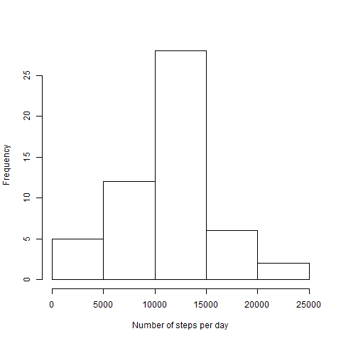
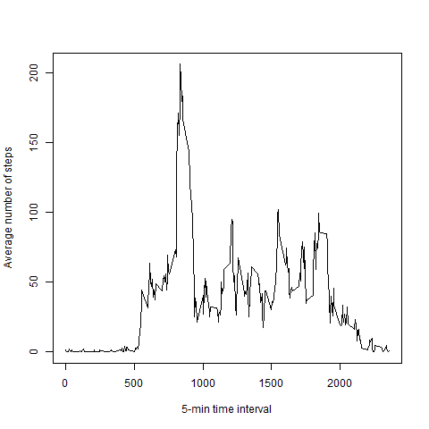
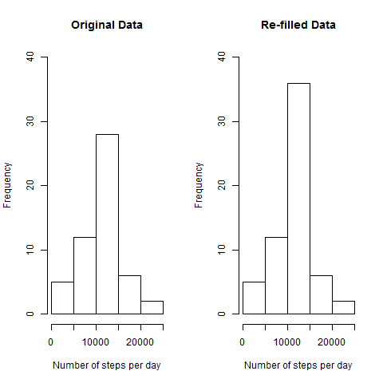
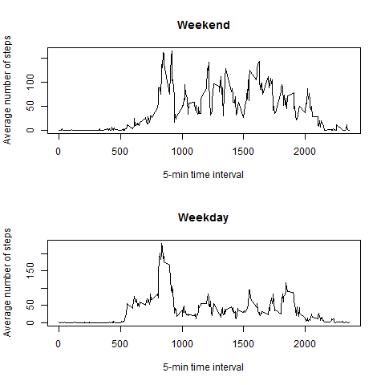

## Loading and preprocessing the data
```{r , echo=TRUE}
# Read data (assuming the data file is in the same directory as the script)
df <- read.csv("activity.csv");
# Format date
df$date <- as.Date( df$date );
```

## What is mean total number of steps taken per day?
Results show a very simetric histogram, which is corroborated by a pretty similar mean and median.
```{r , echo=TRUE}
# Sum steps per day
total_steps_day <- aggregate(steps ~ date, df, FUN=sum);
# Calculate mean and median
print( mean( total_steps_day$steps ) );
print( median( total_steps_day$steps ) );
# Generate histogram
png("instructions_fig/plot1.png");
hist( total_steps_day$steps, main="", xlab="Number of steps per day", ylab="Frequency");
dev.off();
```
 

## What is the average daily activity pattern?
```{r , echo=TRUE}
# Average steps per interval
avg_steps_interval <- aggregate(steps ~ interval, df, FUN=mean);
# Plot average steps per interval
png("instructions_fig/plot2.png");
plot(avg_steps_interval, type='l', xlab="5-min time interval", ylab="Average number of steps")
dev.off();
# Find the interval where the maximum occurs
indMax <- max( avg_steps_interval$steps ) == avg_steps_interval$steps;
print( avg_steps_interval$interval[indMax] );
```
 

## Imputing missing values
The new mean and median for the re-filled dataset become almost identical since the re-filling has been done with average values.
```{r , echo=TRUE}
# Count the number of NA values
print( sum( is.na(df$steps) ) );
# Create a new dataframe to keep the original dataset
df_new <- df
# Associate the average steps per interval to NA values in "steps_new"
indToMatch <- match( df_new$interval, avg_steps_interval$interval );
indNA = is.na( df_new$steps );
df_new$steps[ indNA ] <- avg_steps_interval$steps[ indToMatch[ indNA ]];
# Sum steps per day
total_steps_day_new <- aggregate(steps ~ date, df_new, FUN=sum);
# Calculate mean and median
print( mean( total_steps_day_new$steps ) );
print( median( total_steps_day_new$steps ) );
# Generate histogram
png("instructions_fig/plot3.png");
par(mfrow = c(1,2) )
hist( total_steps_day$steps, ylim=c(0,40), main="Original Data", xlab="Number of steps per day", ylab="Frequency")
hist( total_steps_day_new$steps, ylim=c(0,40), main="Re-filled Data",  xlab="Number of steps per day", ylab="Frequency")
dev.off();
```


## Are there differences in activity patterns between weekdays and weekends?
There is a clear different between weekday and weekend patterns.
```{r , echo=TRUE}
# Create a new variable "day" with two levels "Weekday" and "weekend"
indW = weekdays( df_new$date ) == "Saturday" | weekdays( df_new$date ) == "Sunday";
df_new$day <- factor( indW , labels = c("weekday","weekend"));
# Subset the new dataframe in the factor variable
df_new_wd <- subset( df_new, day=="weekday" );
df_new_we <- subset( df_new, day=="weekend" );
# Average steps per interval
avg_steps_interval_wd <- aggregate(steps ~ interval, df_new_wd, FUN=mean);
avg_steps_interval_we <- aggregate(steps ~ interval, df_new_we, FUN=mean);
# Plot average steps per interval
png("instructions_fig/plot4.png");
par(mfrow = c(2,1) )
plot( avg_steps_interval_we, type='l', main="Weekend", xlab="5-min time interval", ylab="Average number of steps")
plot(avg_steps_interval_wd, type='l', main="Weekday", xlab="5-min time interval", ylab="Average number of steps")
dev.off();
```
 
